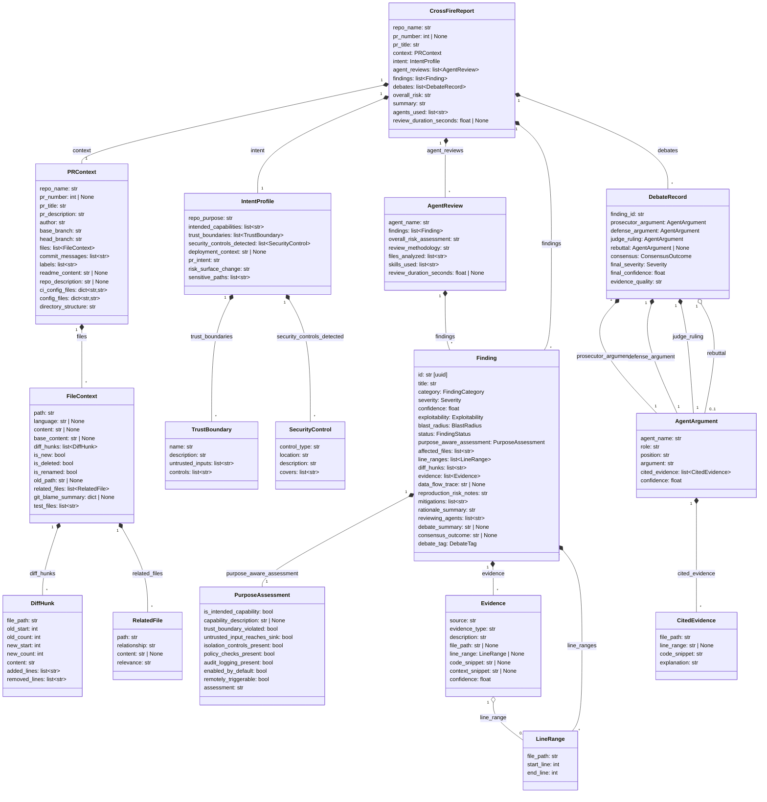

# CrossFire Architecture — Actual Implementation Map

> Generated from source code analysis. Reflects what the code **actually does**, not what the docs say it should do.

---

## 1. Component Inventory

| Component | File | Purpose (from code) | Status | Internal Dependencies |
|-----------|------|---------------------|--------|-----------------------|
| **CLI Entry Point** | `crossfire/cli.py` | Typer app with 6 commands: `analyze-pr`, `analyze-diff`, `report`, `init`, `config-check`, `demo`. Error handler uses `NoReturn` type. Modern `str | None` union syntax | ✅ IMPLEMENTED | `config.settings`, `core.orchestrator`, `core.models`, `core.severity`, `core.context_builder`, `output.*`, `integrations.github.comment_poster` |
| **Default Config** | `crossfire/config/defaults.py` | `DEFAULT_CONFIG` dict — nested default values for all settings | ✅ IMPLEMENTED | _(none)_ |
| **Settings Loader** | `crossfire/config/settings.py` | Loads config with priority: CLI > env > YAML > defaults. Pydantic models for each config section | ✅ IMPLEMENTED | `config.defaults` |
| **Core Models** | `crossfire/core/models.py` | 25+ Pydantic v2 models: `PRContext`, `Finding`, `DebateRecord`, `CrossFireReport`, enums, etc. | ✅ IMPLEMENTED | _(none — leaf module)_ |
| **Context Builder** | `crossfire/core/context_builder.py` | Builds `PRContext` from GitHub PRs, local diffs, staged changes, or patch files. Parses diffs, enriches with file content, imports, blame, tests | ✅ IMPLEMENTED | `config.settings.AnalysisConfig`, `core.models`, `integrations.github.pr_loader` |
| **Intent Inferrer** | `crossfire/core/intent_inference.py` | Multi-signal heuristic engine: README, package metadata, file structure, dependencies, security controls, PR classification | ✅ IMPLEMENTED | `config.settings.RepoConfig`, `core.models` |
| **Finding Synthesizer** | `crossfire/core/finding_synthesizer.py` | Union-find clustering, merges, dedupes findings from multiple agents. Cross-validation boost. Purpose-aware adjustments. Debate routing tags | ✅ IMPLEMENTED | `core.models` |
| **Policy Engine** | `crossfire/core/policy_engine.py` | Applies suppression rules (category, file pattern, title pattern) to findings | ✅ IMPLEMENTED | `core.models` |
| **Severity Gate** | `crossfire/core/severity.py` | `should_fail_ci()` — checks if findings breach severity/confidence threshold | ✅ IMPLEMENTED | `core.models` |
| **Orchestrator** | `crossfire/core/orchestrator.py` | Main pipeline: context → intent → skills → reviews → synthesis → debate → policy → report | ✅ IMPLEMENTED | `agents.debate_engine`, `agents.review_engine`, `config.settings`, `core.context_builder`, `core.finding_synthesizer`, `core.intent_inference`, `core.models`, `core.policy_engine`, `skills.*` (all 6) |
| **Base Agent** | `crossfire/agents/base.py` | Abstract base with CLI + API dual-mode execution, JSON parsing, subprocess runner (with FileNotFoundError → AgentError conversion) | ✅ IMPLEMENTED | `config.settings.AgentConfig` |
| **Claude Adapter** | `crossfire/agents/claude_adapter.py` | CLI: `claude -p "..." --output-format json --system-prompt "..."`. API: `anthropic.AsyncAnthropic.messages.create()` with timeout | ✅ IMPLEMENTED | `agents.base` |
| **Codex Adapter** | `crossfire/agents/codex_adapter.py` | CLI: `codex -q "{system+user prompt}"`. API: `openai.AsyncOpenAI.chat.completions.create()` with timeout | ✅ IMPLEMENTED | `agents.base` |
| **Gemini Adapter** | `crossfire/agents/gemini_adapter.py` | CLI: `gemini "{system+user prompt}"`. API: `google.generativeai.GenerativeModel.generate_content_async()` with `asyncio.wait_for` timeout | ✅ IMPLEMENTED | `agents.base` |
| **Review Engine** | `crossfire/agents/review_engine.py` | Dispatches review prompt to all enabled agents in parallel (`asyncio.gather`), parses structured JSON responses into `AgentReview` with case-insensitive enum parsing via `_parse_enum_flexible()` | ✅ IMPLEMENTED | `agents.base`, `agents.claude_adapter`, `agents.codex_adapter`, `agents.gemini_adapter`, `agents.prompts.review_prompt`, `config.settings`, `core.models` |
| **Debate Engine** | `crossfire/agents/debate_engine.py` | Orchestrates 4-phase debate: prosecution → defense → rebuttal (optional) → judge. Role rotation or fixed assignment | ✅ IMPLEMENTED | `agents.base`, `agents.claude_adapter`, `agents.codex_adapter`, `agents.gemini_adapter`, `agents.consensus`, `agents.prompts.prosecutor_prompt`, `agents.prompts.defense_prompt`, `agents.prompts.judge_prompt`, `config.settings`, `core.models` |
| **Consensus Logic** | `crossfire/agents/consensus.py` | Evidence-quality-based verdict: judge position + cross-checks + purpose-aware override + minimum evidence thresholds | ✅ IMPLEMENTED | `core.models` |
| **Review Prompt** | `crossfire/agents/prompts/review_prompt.py` | System prompt + `build_review_prompt()` — formats all context for agent review | ✅ IMPLEMENTED | `core.models` |
| **Prosecutor Prompt** | `crossfire/agents/prompts/prosecutor_prompt.py` | System prompt + `build_prosecutor_prompt()` | ✅ IMPLEMENTED | _(none)_ |
| **Defense Prompt** | `crossfire/agents/prompts/defense_prompt.py` | System prompt + `build_defense_prompt()` | ✅ IMPLEMENTED | _(none)_ |
| **Judge Prompt** | `crossfire/agents/prompts/judge_prompt.py` | System prompt + `build_judge_prompt()` | ✅ IMPLEMENTED | _(none)_ |
| **Skill Base** | `crossfire/skills/base.py` | `BaseSkill` ABC + `SkillResult` model | ✅ IMPLEMENTED | _(none)_ |
| **Data Flow Tracing** | `crossfire/skills/data_flow_tracing.py` | Regex-based source→sink detection for Python/JS/TS. Same-file variable sharing heuristic | ✅ IMPLEMENTED | `skills.base` |
| **Git Archeology** | `crossfire/skills/git_archeology.py` | Git blame, file history, security commit search, code age, contributors | ✅ IMPLEMENTED | `skills.base` |
| **Config Analysis** | `crossfire/skills/config_analysis.py` | CI workflow risk patterns, Docker risk patterns, security config summary | ✅ IMPLEMENTED | `skills.base` |
| **Dependency Analysis** | `crossfire/skills/dependency_analysis.py` | Manifest diff (requirements.txt, package.json, pyproject.toml), risky package detection | ✅ IMPLEMENTED | `skills.base` |
| **Test Coverage Check** | `crossfire/skills/test_coverage_check.py` | Test file discovery, per-function test existence check, coverage gap summary | ✅ IMPLEMENTED | `skills.base` |
| **Code Navigation** | `crossfire/skills/code_navigation.py` | Import tracing, caller discovery via `git grep`, symbol definition search | ✅ IMPLEMENTED | `skills.base` |
| **Markdown Report** | `crossfire/output/markdown_report.py` | Generates markdown report: summary table, findings by status, debate logs, purpose assessments | ✅ IMPLEMENTED | `core.models` |
| **JSON Report** | `crossfire/output/json_report.py` | `report.model_dump_json(indent=2)` — direct Pydantic serialization | ✅ IMPLEMENTED | `core.models` |
| **SARIF Report** | `crossfire/output/sarif_report.py` | SARIF v2.1.0 with rules (help text), results (partialFingerprints, rank, code snippets, relatedLocations), run properties. Filters rejected findings | ✅ IMPLEMENTED | `core.models` |
| **PR Loader** | `crossfire/integrations/github/pr_loader.py` | Async httpx client: fetches PR metadata, diff, file contents (head+base in parallel), README, repo info, commits, manifest files. Populates `config_files`, `ci_config_files`, `directory_structure` | ✅ IMPLEMENTED | `config.settings.AnalysisConfig`, `core.models`, `core.context_builder.parse_diff` |
| **Comment Poster** | `crossfire/integrations/github/comment_poster.py` | Posts/updates review comment on GitHub PR via Issues API | ✅ IMPLEMENTED | _(none — uses httpx directly)_ |

### Status Legend
- ✅ **IMPLEMENTED** — Code is present, connected, and functional

---

## 2. Full Wiring Diagram

```mermaid
flowchart TD
    subgraph CLI["cli.py — Typer Entry Point"]
        CMD_PR["analyze-pr"]
        CMD_DIFF["analyze-diff"]
        CMD_REPORT["report"]
        CMD_INIT["init"]
        CMD_CHECK["config-check"]
        CMD_DEMO["demo"]
    end

    subgraph CONFIG["Config Layer"]
        DEFAULTS["config/defaults.py<br/>DEFAULT_CONFIG dict"]
        SETTINGS["config/settings.py<br/>load_settings() → CrossFireSettings"]
    end

    subgraph ORCHESTRATOR["core/orchestrator.py — CrossFireOrchestrator"]
        ORCH_PR["analyze_pr()"]
        ORCH_DIFF["analyze_diff()"]
        PIPELINE["_run_pipeline()"]
        SKILL_RUN["_run_skills()"]
        RISK["_compute_overall_risk()"]
        SUMMARY["_build_summary()"]
    end

    subgraph CONTEXT["Context Building"]
        CTX["core/context_builder.py<br/>ContextBuilder"]
        CTX_DIFF["parse_diff()"]
        CTX_ENRICH["_enrich_file_context()"]
        PR_LOAD["integrations/github/pr_loader.py<br/>load_pr_context()"]
    end

    subgraph INTENT["Intent Inference"]
        INFERRER["core/intent_inference.py<br/>IntentInferrer.infer()"]
    end

    subgraph SKILLS["Skills (Pre-compute)"]
        S_DF["data_flow_tracing.py<br/>DataFlowTracingSkill"]
        S_GA["git_archeology.py<br/>GitArcheologySkill"]
        S_CA["config_analysis.py<br/>ConfigAnalysisSkill"]
        S_DA["dependency_analysis.py<br/>DependencyAnalysisSkill"]
        S_TC["test_coverage_check.py<br/>TestCoverageCheckSkill"]
        S_CN["code_navigation.py<br/>CodeNavigationSkill"]
    end

    subgraph AGENTS["Agent Reviews"]
        REVIEW["agents/review_engine.py<br/>ReviewEngine"]
        REVIEW_PROMPT["agents/prompts/review_prompt.py<br/>build_review_prompt()"]
        CLAUDE["agents/claude_adapter.py<br/>ClaudeAgent"]
        CODEX["agents/codex_adapter.py<br/>CodexAgent"]
        GEMINI["agents/gemini_adapter.py<br/>GeminiAgent"]
        BASE["agents/base.py<br/>BaseAgent ABC"]
    end

    subgraph SYNTHESIS["Finding Synthesis"]
        SYNTH["core/finding_synthesizer.py<br/>FindingSynthesizer"]
    end

    subgraph DEBATE["Adversarial Debate"]
        DEBATE_ENG["agents/debate_engine.py<br/>DebateEngine"]
        PROS_PROMPT["prompts/prosecutor_prompt.py"]
        DEF_PROMPT["prompts/defense_prompt.py"]
        JUDGE_PROMPT["prompts/judge_prompt.py"]
        CONSENSUS["agents/consensus.py<br/>compute_consensus()"]
    end

    subgraph POLICY["Policy & Gating"]
        POLICY_ENG["core/policy_engine.py<br/>PolicyEngine"]
        SEVERITY["core/severity.py<br/>should_fail_ci()"]
    end

    subgraph OUTPUT["Report Generation"]
        MD_RPT["output/markdown_report.py"]
        JSON_RPT["output/json_report.py"]
        SARIF_RPT["output/sarif_report.py"]
        COMMENT["integrations/github/comment_poster.py"]
    end

    subgraph MODELS["core/models.py — 25+ Pydantic Models"]
        M_CTX["PRContext, FileContext, DiffHunk"]
        M_INTENT["IntentProfile, TrustBoundary, SecurityControl"]
        M_FIND["Finding, Evidence, PurposeAssessment"]
        M_REVIEW["AgentReview"]
        M_DEBATE["DebateRecord, AgentArgument, CitedEvidence"]
        M_REPORT["CrossFireReport"]
    end

    %% CLI → Config
    CMD_PR -->|"load_settings(cli_overrides)"| SETTINGS
    CMD_DIFF -->|"load_settings(repo_dir, cli_overrides)"| SETTINGS
    CMD_CHECK -->|"load_settings(repo_dir)"| SETTINGS
    CMD_DEMO -->|"load_settings()"| SETTINGS
    SETTINGS -->|"copy.deepcopy(DEFAULT_CONFIG)"| DEFAULTS

    %% CLI → Orchestrator
    CMD_PR -->|"CrossFireOrchestrator(settings)"| ORCH_PR
    CMD_DIFF -->|"CrossFireOrchestrator(settings)"| ORCH_DIFF
    CMD_DEMO -->|"CrossFireOrchestrator(settings)"| PIPELINE

    %% Orchestrator pipeline
    ORCH_PR -->|"build_from_github_pr(repo, pr, token) → PRContext"| CTX
    ORCH_PR -->|"_run_pipeline(context, skip_debate)"| PIPELINE
    ORCH_DIFF -->|"build_from_patch_file/staged/refs → PRContext"| CTX
    ORCH_DIFF -->|"_run_pipeline(context, skip_debate, repo_dir)"| PIPELINE

    %% Context building
    CTX -->|"async"| PR_LOAD
    CTX -->|"parse_diff()"| CTX_DIFF
    CTX -->|"_enrich_file_context()"| CTX_ENRICH
    PR_LOAD -->|"config_files, ci_config_files, directory_structure"| M_CTX

    %% Pipeline steps
    PIPELINE -->|"1. infer(context) → IntentProfile"| INFERRER
    PIPELINE -->|"2. _run_skills(context, intent, repo_dir)"| SKILL_RUN
    SKILL_RUN --> S_DF
    SKILL_RUN --> S_GA
    SKILL_RUN --> S_CA
    SKILL_RUN --> S_DA
    SKILL_RUN --> S_TC
    SKILL_RUN --> S_CN
    PIPELINE -->|"3. run_independent_reviews(ctx, intent, skills) → list[AgentReview]"| REVIEW
    PIPELINE -->|"4. synthesize(reviews, intent) → list[Finding]"| SYNTH
    PIPELINE -->|"5. debate_all(findings, ctx, intent) → list[DebateRecord]"| DEBATE_ENG
    PIPELINE -->|"6. policy_engine.apply(findings)"| POLICY_ENG
    PIPELINE -->|"7. _compute_overall_risk()"| RISK

    %% Review engine
    REVIEW -->|"build_review_prompt(ctx, intent, skills)"| REVIEW_PROMPT
    REVIEW -->|"asyncio.gather(*tasks)"| CLAUDE
    REVIEW -->|"asyncio.gather(*tasks)"| CODEX
    REVIEW -->|"asyncio.gather(*tasks)"| GEMINI
    CLAUDE --> BASE
    CODEX --> BASE
    GEMINI --> BASE

    %% Debate engine
    DEBATE_ENG -->|"prosecution"| PROS_PROMPT
    DEBATE_ENG -->|"defense"| DEF_PROMPT
    DEBATE_ENG -->|"judge"| JUDGE_PROMPT
    DEBATE_ENG -->|"compute_consensus(debate, intent)"| CONSENSUS
    DEBATE_ENG -->|"agents execute prompts"| CLAUDE
    DEBATE_ENG -->|"agents execute prompts"| CODEX
    DEBATE_ENG -->|"agents execute prompts"| GEMINI

    %% Output
    CMD_PR -->|"_output_report(report, fmt)"| MD_RPT
    CMD_PR -->|"_output_report(report, fmt)"| JSON_RPT
    CMD_PR -->|"_output_report(report, fmt)"| SARIF_RPT
    CMD_PR -->|"_check_severity_gate()"| SEVERITY
    CMD_PR -->|"post_review_comment()"| COMMENT
    CMD_DIFF -->|"_output_report(report, fmt)"| MD_RPT
    CMD_DIFF -->|"_check_severity_gate()"| SEVERITY
    CMD_REPORT -->|"_output_report(report, fmt)"| MD_RPT

```



### Connection Legend
- **Solid arrows** → real, working connections

---

## 3. Data Model Relationship Diagram



### Instantiation Map (where each model is actually created)

| Model | Created In | Notes |
|-------|-----------|-------|
| `PRContext` | `context_builder.py`, `pr_loader.py`, `cli.py` (demo) | ✅ All three paths |
| `FileContext` | `context_builder.parse_diff()` | ✅ |
| `DiffHunk` | `context_builder.parse_diff()` | ✅ |
| `RelatedFile` | `context_builder._find_imports_*()`, `_find_reverse_imports()` | ✅ |
| `IntentProfile` | `intent_inference.IntentInferrer.infer()` | ✅ |
| `TrustBoundary` | `intent_inference._infer_trust_boundaries()` | ✅ |
| `SecurityControl` | `intent_inference._detect_security_controls()` | ✅ |
| `Finding` | `review_engine._parse_finding_from_raw()`, `finding_synthesizer._merge_findings()` | ✅ |
| `Evidence` | `review_engine._parse_finding_from_raw()` | ✅ |
| `PurposeAssessment` | `review_engine._parse_finding_from_raw()` | ✅ |
| `LineRange` | `review_engine._parse_finding_from_raw()` | ✅ |
| `AgentReview` | `review_engine._dispatch_to_agent()` | ✅ |
| `AgentArgument` | `debate_engine._parse_agent_argument()` | ✅ |
| `CitedEvidence` | `debate_engine._parse_agent_argument()` | ✅ |
| `DebateRecord` | `debate_engine._debate_single()` | ✅ |
| `CrossFireReport` | `orchestrator._run_pipeline()` | ✅ |

### Enums (all instantiated)

| Enum | Values | Used By |
|------|--------|---------|
| `FindingCategory` | 50 categories across 7 groups | `Finding.category` |
| `Severity` | Critical, High, Medium, Low | `Finding.severity`, `DebateRecord.final_severity` |
| `Exploitability` | Proven, Likely, Possible, Unlikely | `Finding.exploitability` |
| `BlastRadius` | System, Service, Component, Limited | `Finding.blast_radius` |
| `FindingStatus` | Confirmed, Likely, Unclear, Rejected | `Finding.status` |
| `ConsensusOutcome` | Confirmed, Likely, Unclear, Rejected | `DebateRecord.consensus` |
| `DebateTag` | needs_debate, auto_confirmed, informational | `Finding.debate_tag` |

---

## 4. Call Graph — Entry Point Traces

### COMMAND: `crossfire analyze-pr --repo owner/repo --pr 123 --github-token XXX`

```
cli.py:37 analyze_pr(repo: str, pr: int, github_token: str, agents: str|None,
                      skip_debate: bool, context_depth: str|None, output: str|None,
                      format: str, post_comment: bool, verbose: bool, dry_run: bool)
│
├─ config/settings.py:148 load_settings(cli_overrides={"analysis": {"context_depth": X}})
│  ├─ copy.deepcopy(DEFAULT_CONFIG)
│  ├─ _find_config_file() → Path | None
│  ├─ _load_yaml_config(path) → dict  [if config found]
│  ├─ _deep_merge(defaults, file_config)
│  ├─ _deep_merge(merged, cli_overrides)
│  └─ _parse_agents_config(merged) → (agents, debate, skills)
│     └─ Returns CrossFireSettings
│
├─ core/orchestrator.py:42 CrossFireOrchestrator.__init__(settings: CrossFireSettings)
│  ├─ ContextBuilder(settings.analysis)
│  ├─ IntentInferrer(settings.repo)
│  ├─ ReviewEngine(settings)
│  ├─ FindingSynthesizer()
│  ├─ DebateEngine(settings)
│  └─ PolicyEngine(settings.suppressions)
│
├─ core/orchestrator.py:51 analyze_pr(repo, pr_number, github_token, skip_debate)
│  │
│  ├─ core/context_builder.py:569 build_from_github_pr(repo, pr_number, github_token)
│  │  └─ integrations/github/pr_loader.py:13 load_pr_context(repo, pr_number, token, config)
│  │     ├─ httpx GET /repos/{repo}/pulls/{pr_number} → pr_data
│  │     ├─ _fetch_all_pr_files(client, repo, pr) → files_data (paginated, 100/page)
│  │     ├─ httpx GET /repos/{repo}/pulls/{pr_number} (Accept: diff) → diff_text
│  │     ├─ core/context_builder.py:143 parse_diff(diff_text) → list[FileContext]
│  │     ├─ asyncio.gather(*[_fetch_file_content(fc) for fc in files])  ← parallel
│  │     │  ├─ httpx GET /repos/{repo}/contents/{path}?ref=head → fc.content
│  │     │  └─ httpx GET /repos/{repo}/contents/{old_path|path}?ref=base → fc.base_content
│  │     ├─ asyncio.gather(readme_task, repo_task, commits_task)  ← parallel
│  │     │  ├─ httpx GET /repos/{repo}/readme → readme_content
│  │     │  ├─ httpx GET /repos/{repo} → repo_description
│  │     │  └─ httpx GET /repos/{repo}/pulls/{pr_number}/commits → commit_messages
│  │     ├─ Fetch manifest files for intent inference (requirements.txt, package.json, etc.)
│  │     ├─ _build_directory_structure(file_paths) → directory tree string
│  │     ├─ Identify config_files and ci_config_files from changed files
│  │     └─ Returns PRContext (fully populated including config_files, ci_config_files, directory_structure)
│  │
│  └─ core/orchestrator.py:105 _run_pipeline(context, skip_debate, repo_dir=None)
│     │
│     ├─ [Step 1] core/intent_inference.py:136 infer(context) → IntentProfile
│     │  ├─ _extract_purpose_from_readme(readme)
│     │  ├─ _analyze_package_metadata(config_files)  ✅ populated for GH PRs
│     │  ├─ _analyze_file_structure(directory_structure)  ✅ populated for GH PRs
│     │  ├─ _analyze_dependencies(config_files)  ✅ populated for GH PRs
│     │  ├─ _detect_security_controls(context)
│     │  ├─ _infer_trust_boundaries(capabilities, controls)
│     │  ├─ _classify_pr_intent(title, description)
│     │  ├─ _analyze_risk_surface_change(context)
│     │  └─ _detect_sensitive_paths(context)
│     │
│     ├─ [Step 2] if repo_dir is not None:
│     │  │  await asyncio.to_thread(_run_skills, context, intent, repo_dir)
│     │  │  ├─ DataFlowTracingSkill().execute(repo_dir, changed_files)
│     │  │  ├─ GitArcheologySkill().execute(repo_dir, changed_files)
│     │  │  ├─ ConfigAnalysisSkill().execute(repo_dir, changed_files)
│     │  │  ├─ DependencyAnalysisSkill().execute(repo_dir, changed_files, file_contexts=context.files)
│     │  │  ├─ TestCoverageCheckSkill().execute(repo_dir, changed_files)
│     │  │  └─ CodeNavigationSkill().execute(repo_dir, changed_files)
│     │  └─ else: skills skipped (no local checkout for GH PRs)
│     │
│     ├─ [Step 3] agents/review_engine.py:143 run_independent_reviews(ctx, intent, skill_outputs)
│     │  ├─ build_review_prompt(context, intent, skill_outputs) → prompt string
│     │  ├─ for each enabled agent: _create_agent(name, config) → BaseAgent
│     │  └─ asyncio.gather(*[_dispatch_to_agent(agent, prompt, sys_prompt)])
│     │     └─ per agent:
│     │        ├─ agent.execute(prompt, REVIEW_SYSTEM_PROMPT) → raw JSON string
│     │        ├─ agent.parse_json_response(raw) → dict
│     │        ├─ _parse_finding_from_raw(finding_dict, agent_name) → Finding
│     │        └─ Returns AgentReview
│     │
│     ├─ [Step 4] core/finding_synthesizer.py:125 synthesize(reviews, intent)
│     │  ├─ Collect all findings from all reviews
│     │  ├─ Union-find clustering of similar findings (_is_similar_finding)
│     │  ├─ Merge clusters (_merge_findings)
│     │  ├─ Cross-validation confidence boost (2 agents: ×1.2, 3+: ×1.4)
│     │  ├─ _apply_purpose_aware_adjustments(finding, intent)
│     │  └─ _tag_for_debate(finding) → sets DebateTag
│     │
│     ├─ [Step 5] agents/debate_engine.py:148 debate_all(findings, context, intent)
│     │  └─ for each finding with debate_tag == NEEDS_DEBATE:
│     │     └─ _debate_single(finding, context, intent) → DebateRecord | None
│     │        ├─ _assign_roles() → (prosecutor, defense, judge)
│     │        ├─ Create agent instances from AGENT_CLASSES
│     │        ├─ _run_prosecution(agent, ...) → AgentArgument
│     │        │  ├─ build_prosecutor_prompt(finding_summary, evidence, ctx, intent)
│     │        │  └─ agent.execute(prompt, PROSECUTOR_SYSTEM_PROMPT)
│     │        ├─ _run_defense(agent, ...) → AgentArgument
│     │        │  ├─ build_defense_prompt(finding_summary, evidence, prosecutor_arg, ctx, intent)
│     │        │  └─ agent.execute(prompt, DEFENSE_SYSTEM_PROMPT)
│     │        ├─ _run_rebuttal(agent, ...) → AgentArgument  [if enable_rebuttal]
│     │        ├─ _run_judge(agent, ...) → (AgentArgument, raw_response)
│     │        │  ├─ build_judge_prompt(finding_summary, pros_arg, def_arg, rebuttal, intent)
│     │        │  └─ agent.execute(prompt, JUDGE_SYSTEM_PROMPT)
│     │        ├─ Parse final_severity from judge raw JSON
│     │        ├─ Build DebateRecord
│     │        ├─ agents/consensus.py:54 compute_consensus(debate, intent) → ConsensusOutcome
│     │        │  ├─ _evidence_quality_score(prosecutor) → float
│     │        │  ├─ _evidence_quality_score(defense) → float
│     │        │  ├─ Map judge position → initial outcome
│     │        │  ├─ Cross-check with other positions
│     │        │  ├─ Weak evidence downgrades
│     │        │  └─ Purpose-aware override
│     │        └─ _apply_debate_result(finding, debate) → updates finding status/severity
│     │
│     ├─ [Step 6] core/policy_engine.py:21 apply(findings) → list[Finding]
│     │  └─ for each finding: _check_suppressions(finding) → match by category/file/title
│     │
│     ├─ [Step 7] _compute_overall_risk(findings) → "critical"|"high"|"medium"|"low"|"none"
│     │
│     └─ Returns CrossFireReport
│
├─ cli.py:310 _output_report(report, format, output, post_comment, repo, pr_number, github_token)
│  ├─ generate_markdown_report(report) | generate_json_report(report) | generate_sarif_report(report)
│  ├─ Write to file or console
│  └─ if post_comment: post_review_comment(repo, pr_number, token, md_content)
│
└─ cli.py:287 _check_severity_gate(report, settings)
   └─ core/severity.py:15 should_fail_ci(findings, fail_on, min_confidence, require_debate)
      └─ typer.Exit(1) if breached
```

### COMMAND: `crossfire analyze-diff --patch changes.patch --repo-dir /path/to/repo`

```
cli.py:101 analyze_diff(patch: str, repo_dir: str, staged: bool, base: str|None,
                         head: str|None, agents: str|None, skip_debate: bool,
                         context_depth: str|None, output: str|None, format: str,
                         verbose: bool, dry_run: bool)
│
├─ load_settings(repo_dir=repo_dir, cli_overrides=...)
├─ CrossFireOrchestrator(settings)
├─ orchestrator.analyze_diff(repo_dir, patch_path, staged, base_ref, head_ref, skip_debate)
│  │
│  ├─ if patch_path:   context_builder.build_from_patch_file(patch_path, repo_dir) → PRContext
│  ├─ elif staged:     context_builder.build_from_staged(repo_dir) → PRContext
│  ├─ elif base+head:  context_builder.build_from_refs(repo_dir, base, head) → PRContext
│  │  └─ All three call build_from_diff(diff_text, repo_dir, ...)
│  │     ├─ parse_diff(diff_text) → list[FileContext]
│  │     ├─ _enrich_file_context(fc, repo_dir, base_ref) for each file
│  │     │  ├─ _read_file_safe(path) → head content
│  │     │  ├─ _get_file_at_ref(old_path|path, base_ref) → base content
│  │     │  ├─ _find_imports(content, path, lang, repo_dir) → related files
│  │     │  ├─ _find_reverse_imports(path, repo_dir, lang) → imported_by
│  │     │  ├─ _get_git_blame_summary(path, repo_dir) → blame dict
│  │     │  └─ _find_test_files(path, repo_dir) → test files
│  │     ├─ _collect_configs(repo_dir) → config_files ✅ populated for local
│  │     ├─ _collect_ci_configs(configs) → ci_config_files ✅ populated for local
│  │     ├─ _get_directory_structure(repo_dir) ✅ populated for local
│  │     └─ Returns PRContext (fully enriched)
│  │
│  └─ _run_pipeline(context, skip_debate, repo_dir=repo_dir)  ✅ repo_dir passed
│     └─ [same pipeline as analyze-pr, but skills get correct repo_dir]
│
├─ _output_report(report, format, output, False)
└─ _check_severity_gate(report, settings)
```

### COMMAND: `crossfire report --input results.json --format sarif`

```
cli.py:167 report(input: str, format: str, output: str|None)
│
├─ Path(input).read_text() → JSON string
├─ json.loads(text) → dict
├─ CrossFireReport(**data) → report object
└─ _output_report(report, format, output, False)
   └─ generate_sarif_report(report) → SARIF JSON string
```

### COMMAND: `crossfire init`

```
cli.py:187 init()
│
├─ Path.cwd() / ".crossfire" → config_dir
├─ config_dir.mkdir(exist_ok=True)
├─ If .crossfire/config.yaml exists → exit
├─ If .crossfire/config.example.yaml exists at __file__/../../ → shutil.copy
└─ Else → config_file.write_text(_default_config_yaml())
```

### COMMAND: `crossfire config-check --repo-dir /path`

```
cli.py:207 config_check(repo_dir: str)
│
├─ load_settings(repo_dir=repo_dir)
└─ Print agents, context_depth, debate config, severity_gate
```

### COMMAND: `crossfire demo --fixture auth_bypass_regression`

```
cli.py:226 demo(fixture: str, format: str, verbose: bool)
│
├─ fixtures_dir = Path(__file__).parent.parent / "tests/fixtures/prs" / fixture
├─ diff_path = fixtures_dir / "diff.patch"
├─ context_path = fixtures_dir / "context.json"
├─ diff_text = diff_path.read_text()
├─ parse_diff(diff_text) → files
├─ json.loads(context_path.read_text()) → context_meta
├─ PRContext(repo_name=..., pr_title=..., files=files)
├─ load_settings()
├─ CrossFireOrchestrator(settings)
├─ orchestrator._run_pipeline(pr_context, skip_debate=False)
└─ _output_report(report, format, None, False)
```

---

## 5. Dependency Direction Map

### Layered Diagram

```
LAYER 0 — Leaf modules (no internal deps):
  ├─ crossfire/core/models.py
  ├─ crossfire/config/defaults.py
  ├─ crossfire/skills/base.py
  ├─ crossfire/agents/prompts/prosecutor_prompt.py
  ├─ crossfire/agents/prompts/defense_prompt.py
  └─ crossfire/agents/prompts/judge_prompt.py

LAYER 1 — Depends only on Layer 0:
  ├─ crossfire/config/settings.py → config/defaults.py
  ├─ crossfire/core/policy_engine.py → core/models.py
  ├─ crossfire/core/severity.py → core/models.py
  ├─ crossfire/output/json_report.py → core/models.py
  ├─ crossfire/output/markdown_report.py → core/models.py
  ├─ crossfire/output/sarif_report.py → core/models.py
  ├─ crossfire/agents/consensus.py → core/models.py
  └─ crossfire/integrations/github/comment_poster.py → (none internal)

LAYER 2 — Depends on Layer 0-1:
  ├─ crossfire/agents/base.py → config/settings.py (AgentConfig)
  ├─ crossfire/core/intent_inference.py → config/settings.py (RepoConfig), core/models.py
  ├─ crossfire/agents/prompts/review_prompt.py → core/models.py
  ├─ crossfire/skills/data_flow_tracing.py → skills/base.py
  ├─ crossfire/skills/git_archeology.py → skills/base.py
  ├─ crossfire/skills/config_analysis.py → skills/base.py
  ├─ crossfire/skills/dependency_analysis.py → skills/base.py
  ├─ crossfire/skills/test_coverage_check.py → skills/base.py
  └─ crossfire/skills/code_navigation.py → skills/base.py

LAYER 3 — Depends on Layer 0-2:
  ├─ crossfire/agents/claude_adapter.py → agents/base.py
  ├─ crossfire/agents/codex_adapter.py → agents/base.py
  ├─ crossfire/agents/gemini_adapter.py → agents/base.py
  └─ crossfire/core/context_builder.py → config/settings.py (AnalysisConfig), core/models.py
      └─ Lazy import: integrations/github/pr_loader.py [Layer 3b]

LAYER 3b — Depends on Layer 0-3:
  └─ crossfire/integrations/github/pr_loader.py → config/settings.py (AnalysisConfig),
                                                    core/models.py, core/context_builder.parse_diff

LAYER 4 — Depends on Layer 0-3:
  ├─ crossfire/agents/review_engine.py → agents/base.py, agents/claude_adapter.py,
  │                                       agents/codex_adapter.py, agents/gemini_adapter.py,
  │                                       agents/prompts/review_prompt.py, config/settings.py,
  │                                       core/models.py
  ├─ crossfire/agents/debate_engine.py → agents/base.py, agents/claude_adapter.py,
  │                                       agents/codex_adapter.py, agents/gemini_adapter.py,
  │                                       agents/consensus.py, agents/prompts/prosecutor_prompt.py,
  │                                       agents/prompts/defense_prompt.py, agents/prompts/judge_prompt.py,
  │                                       config/settings.py, core/models.py
  └─ crossfire/core/finding_synthesizer.py → core/models.py

LAYER 5 — Orchestration (depends on Layer 0-4):
  └─ crossfire/core/orchestrator.py → agents/debate_engine.py, agents/review_engine.py,
                                       config/settings.py, core/context_builder.py,
                                       core/finding_synthesizer.py, core/intent_inference.py,
                                       core/models.py, core/policy_engine.py,
                                       skills/* (all 6)

LAYER 6 — Entry point (depends on Layer 0-5):
  └─ crossfire/cli.py → config/settings.py, core/orchestrator.py, core/models.py,
                          core/context_builder.py (parse_diff only in demo),
                          core/severity.py, output/* (all 3),
                          integrations/github/comment_poster.py
```

**No layer violations detected.** All imports flow downward. No circular dependencies.

### Mermaid Dependency Graph

```mermaid
flowchart BT
    subgraph L0["Layer 0 — Leaf"]
        MODELS["core/models.py"]
        DEFAULTS["config/defaults.py"]
        SKILL_BASE["skills/base.py"]
        PROS_P["prompts/prosecutor"]
        DEF_P["prompts/defense"]
        JUDGE_P["prompts/judge"]
    end

    subgraph L1["Layer 1"]
        SETTINGS["config/settings.py"]
        POLICY["core/policy_engine.py"]
        SEVERITY["core/severity.py"]
        JSON_R["output/json_report.py"]
        MD_R["output/markdown_report.py"]
        SARIF_R["output/sarif_report.py"]
        CONSENSUS["agents/consensus.py"]
        POSTER["github/comment_poster.py"]
    end

    subgraph L2["Layer 2"]
        BASE_AGENT["agents/base.py"]
        INTENT["core/intent_inference.py"]
        REV_PROMPT["prompts/review_prompt.py"]
        S_DF["skills/data_flow"]
        S_GA["skills/git_archeology"]
        S_CA["skills/config_analysis"]
        S_DA["skills/dependency"]
        S_TC["skills/test_coverage"]
        S_CN["skills/code_nav"]
    end

    subgraph L3["Layer 3"]
        CLAUDE["agents/claude"]
        CODEX["agents/codex"]
        GEMINI["agents/gemini"]
        CTX["core/context_builder"]
        PR_LOAD["github/pr_loader"]
    end

    subgraph L4["Layer 4"]
        REVIEW["agents/review_engine"]
        DEBATE["agents/debate_engine"]
        SYNTH["core/finding_synth"]
    end

    subgraph L5["Layer 5"]
        ORCH["core/orchestrator"]
    end

    subgraph L6["Layer 6"]
        CLI["cli.py"]
    end

    %% L1 deps
    SETTINGS --> DEFAULTS
    POLICY --> MODELS
    SEVERITY --> MODELS
    JSON_R --> MODELS
    MD_R --> MODELS
    SARIF_R --> MODELS
    CONSENSUS --> MODELS

    %% L2 deps
    BASE_AGENT --> SETTINGS
    INTENT --> SETTINGS
    INTENT --> MODELS
    REV_PROMPT --> MODELS
    S_DF --> SKILL_BASE
    S_GA --> SKILL_BASE
    S_CA --> SKILL_BASE
    S_DA --> SKILL_BASE
    S_TC --> SKILL_BASE
    S_CN --> SKILL_BASE

    %% L3 deps
    CLAUDE --> BASE_AGENT
    CODEX --> BASE_AGENT
    GEMINI --> BASE_AGENT
    CTX --> SETTINGS
    CTX --> MODELS
    PR_LOAD --> SETTINGS
    PR_LOAD --> MODELS
    PR_LOAD -.-> CTX

    %% L4 deps
    REVIEW --> BASE_AGENT
    REVIEW --> CLAUDE
    REVIEW --> CODEX
    REVIEW --> GEMINI
    REVIEW --> REV_PROMPT
    REVIEW --> SETTINGS
    REVIEW --> MODELS
    DEBATE --> BASE_AGENT
    DEBATE --> CLAUDE
    DEBATE --> CODEX
    DEBATE --> GEMINI
    DEBATE --> CONSENSUS
    DEBATE --> PROS_P
    DEBATE --> DEF_P
    DEBATE --> JUDGE_P
    DEBATE --> SETTINGS
    DEBATE --> MODELS
    SYNTH --> MODELS

    %% L5 deps
    ORCH --> REVIEW
    ORCH --> DEBATE
    ORCH --> SETTINGS
    ORCH --> CTX
    ORCH --> SYNTH
    ORCH --> INTENT
    ORCH --> MODELS
    ORCH --> POLICY
    ORCH --> S_DF
    ORCH --> S_GA
    ORCH --> S_CA
    ORCH --> S_DA
    ORCH --> S_TC
    ORCH --> S_CN

    %% L6 deps
    CLI --> ORCH
    CLI --> SETTINGS
    CLI --> MODELS
    CLI --> SEVERITY
    CLI --> MD_R
    CLI --> JSON_R
    CLI --> SARIF_R
    CLI --> POSTER
```



---

## 6. Async Boundary Map

```
SYNC WORLD:
  ├─ cli.py (entry point — all commands are sync functions)
  ├─ config/defaults.py, config/settings.py — all sync
  ├─ core/context_builder.py — most methods are sync
  │   ├─ parse_diff() — sync
  │   ├─ build_from_diff() — sync
  │   ├─ build_from_staged() — sync
  │   ├─ build_from_refs() — sync
  │   ├─ build_from_patch_file() — sync
  │   ├─ _enrich_file_context() — sync (subprocess.run for git, os.walk for FS)
  │   └─ build_from_github_pr() — ❗ ASYNC (the only async method)
  ├─ core/intent_inference.py — all sync (regex, string ops)
  ├─ core/finding_synthesizer.py — all sync
  ├─ core/policy_engine.py — all sync
  ├─ core/severity.py — all sync
  ├─ skills/* — ALL SYNC (subprocess.run, open(), os.walk)
  ├─ output/* — all sync (string building)
  └─ agents/prompts/* — all sync (string building)

ASYNC BOUNDARY (asyncio.run() calls):
  ├─ cli.py:86   asyncio.run(orchestrator.analyze_pr(...))
  ├─ cli.py:153  asyncio.run(orchestrator.analyze_diff(...))
  ├─ cli.py:282  asyncio.run(orchestrator._run_pipeline(...))
  └─ cli.py:347  asyncio.run(post_review_comment(...))  [inside _output_report]

ASYNC WORLD:
  ├─ core/orchestrator.py
  │   ├─ analyze_pr() — async
  │   ├─ analyze_diff() — async
  │   └─ _run_pipeline() — async
  │       └─ _run_skills() offloaded via asyncio.to_thread() — does not block event loop
  │          Skills skipped entirely when repo_dir is None (GitHub PR mode)
  │
  ├─ core/context_builder.py
  │   └─ build_from_github_pr() — async
  │
  ├─ integrations/github/pr_loader.py
  │   └─ load_pr_context() — async (httpx.AsyncClient)
  │
  ├─ agents/review_engine.py
  │   ├─ run_independent_reviews() — async
  │   └─ _dispatch_to_agent() — async
  │
  ├─ agents/base.py
  │   ├─ execute() — async
  │   ├─ _run_cli() — async (abstract)
  │   ├─ _run_api() — async (abstract)
  │   └─ _run_subprocess() — async (asyncio.create_subprocess_exec)
  │
  ├─ agents/*_adapter.py
  │   ├─ _run_cli() — async (delegates to _run_subprocess)
  │   └─ _run_api() — async (all use native async SDK clients)
  │       ├─ claude: anthropic.AsyncAnthropic.messages.create() — fully async with timeout
  │       ├─ codex: openai.AsyncOpenAI.chat.completions.create() — fully async with timeout
  │       └─ gemini: genai.GenerativeModel.generate_content_async() — async with asyncio.wait_for timeout
  │
  ├─ agents/debate_engine.py
  │   ├─ debate_all() — async
  │   ├─ _debate_single() — async
  │   ├─ _run_prosecution() — async
  │   ├─ _run_defense() — async
  │   ├─ _run_rebuttal() — async
  │   └─ _run_judge() — async
  │
  └─ integrations/github/comment_poster.py
      └─ post_review_comment() — async (httpx.AsyncClient)
```

### Sync-in-Async Issues

All previously identified sync-in-async issues have been resolved:

| Location | Resolution |
|----------|-----------|
| `orchestrator._run_skills()` | Now offloaded via `asyncio.to_thread()` — skills run in a thread pool, no longer blocking the event loop. Skipped entirely for GitHub PR mode (no local checkout) |
| `claude_adapter._run_api()` | Now uses `anthropic.AsyncAnthropic` with configurable timeout |
| `codex_adapter._run_api()` | Now uses `openai.AsyncOpenAI` with configurable timeout |
| `gemini_adapter._run_api()` | Now uses `generate_content_async()` with `asyncio.wait_for` timeout |

> All three API adapters use native async SDK clients. Reviews dispatched via `asyncio.gather()` now execute truly concurrently in both CLI and API modes.

---

## 7. Config Flow Map

```
Source Priority (highest wins):
  1. CLI flags (--context-depth, --agents, --skip-debate, etc.)
  2. Environment: CROSSFIRE_CONFIG_PATH, GITHUB_TOKEN, API key env vars
  3. .crossfire/config.yaml (in repo root or CROSSFIRE_CONFIG_PATH)
  4. crossfire/config/defaults.py DEFAULT_CONFIG

Loading:
  load_settings(repo_dir, cli_overrides)
       │
       ├─ copy.deepcopy(DEFAULT_CONFIG)           ← Layer 4: defaults
       ├─ _find_config_file(repo_dir)             ← Layer 3: YAML file
       │   └─ CROSSFIRE_CONFIG_PATH env           ← Layer 2: env override
       ├─ _deep_merge(defaults, yaml)
       ├─ _deep_merge(merged, cli_overrides)      ← Layer 1: CLI flags
       └─ _parse_agents_config(merged)
           └─ Returns CrossFireSettings
```

### Config Consumption Map

| Component | Receives Config Via | Fields Actually Read |
|-----------|-------------------|---------------------|
| `CrossFireOrchestrator` | Constructor: `settings: CrossFireSettings` | `settings.analysis`, `settings.repo`, `settings.agents`, `settings.debate`, `settings.skills`, `settings.suppressions` |
| `ContextBuilder` | Constructor: `analysis_config: AnalysisConfig` | `context_depth`, `max_related_files`, `include_test_files` |
| `IntentInferrer` | Constructor: `repo_config: RepoConfig` | `purpose`, `intended_capabilities`, `sensitive_paths` |
| `ReviewEngine` | Constructor: `settings: CrossFireSettings` | `settings.agents` (which are enabled, their AgentConfig) |
| `DebateEngine` | Constructor: `settings: CrossFireSettings` | `settings.debate` (role_assignment, fixed_roles, enable_rebuttal, min_agents_for_debate), `settings.agents` |
| `PolicyEngine` | Constructor: `suppressions: list[dict]` | Full suppression rules |
| `BaseAgent` (all 3) | Constructor: `config: AgentConfig` | `mode`, `cli_command`, `cli_args`, `model`, `api_key_env`, `timeout` |
| `_check_severity_gate()` | Direct access: `settings.severity_gate` | `fail_on`, `min_confidence`, `require_debate` |
| `_run_skills()` | Direct access: `settings.skills` | `data_flow_tracing`, `git_archeology`, `config_analysis`, `dependency_analysis`, `test_coverage_check`, `code_navigation` (all booleans) |

### Config Fields Defined But Never Enforced

| Field | Defined In | Issue |
|-------|-----------|-------|
| `require_evidence_citations` | `DebateConfig` | 💀 Never validated — no code checks that arguments contain citations |
| `verbose` | CLI flags in 3 commands | 💀 Accepted but never wired to logging |

> `include_test_files` (previously listed here) is now wired — `ContextBuilder` checks this config before calling `_find_test_files()`.

---

## 8. External Interface Map

### GitHub REST API (httpx async client)

| Endpoint | Method | Used In | Purpose |
|----------|--------|---------|---------|
| `/repos/{repo}/pulls/{pr}` | GET | `pr_loader.py` | PR metadata (title, body, author, base/head refs, labels) |
| `/repos/{repo}/pulls/{pr}/files?per_page=100&page=N` | GET | `pr_loader.py` | PR file list (paginated, used for directory structure, config/CI file identification) |
| `/repos/{repo}/pulls/{pr}` | GET (Accept: diff) | `pr_loader.py` | Raw unified diff |
| `/repos/{repo}/contents/{path}?ref={sha}` | GET (Accept: raw) | `pr_loader.py` | File content at head/base ref (fetched in parallel via asyncio.gather) |
| `/repos/{repo}/readme` | GET (Accept: raw) | `pr_loader.py` | README content |
| `/repos/{repo}` | GET | `pr_loader.py` | Repo description |
| `/repos/{repo}/pulls/{pr}/commits` | GET | `pr_loader.py` | Commit messages |
| `/repos/{repo}/contents/{manifest}?ref={head}` | GET (Accept: raw) | `pr_loader.py` | Manifest files for intent inference (requirements.txt, package.json, etc.) |
| `/repos/{repo}/issues/{pr}/comments?per_page=100&page=N` | GET | `comment_poster.py` | Check for existing CrossFire comment (paginated) |
| `/repos/{repo}/issues/comments/{id}` | PATCH | `comment_poster.py` | Update existing comment |
| `/repos/{repo}/issues/{pr}/comments` | POST | `comment_poster.py` | Create new comment |

Auth: `Bearer {GITHUB_TOKEN}` header on all requests.

### Claude Code CLI

```
Command: claude -p "{prompt}" --output-format json --system-prompt "{system_prompt}" {extra_cli_args}
Fallback: anthropic.AsyncAnthropic(api_key=ANTHROPIC_API_KEY, timeout=config.timeout).messages.create(
            model="{config.model}", system="{system_prompt}",
            messages=[{"role": "user", "content": "{prompt}"}], max_tokens=8192)
```

### Codex CLI

```
Command: codex -q "{system_prompt}\n\n{prompt}" {extra_cli_args}
Fallback: openai.AsyncOpenAI(api_key=OPENAI_API_KEY, timeout=config.timeout).chat.completions.create(
            model="{config.model}",
            messages=[{"role": "system", "content": "..."}, {"role": "user", "content": "..."}])
```

### Gemini CLI

```
Command: gemini "{system_prompt}\n\n{prompt}" {extra_cli_args}
Fallback: await asyncio.wait_for(
            google.generativeai.GenerativeModel("{config.model}",
                system_instruction="{system_prompt}").generate_content_async("{prompt}"),
            timeout=config.timeout)
```

### Local Git (subprocess.run — sync)

| Command | Used In | Purpose |
|---------|---------|---------|
| `git diff --cached` | `context_builder.build_from_staged()` | Staged changes |
| `git diff` | `context_builder.build_from_staged()` | Unstaged changes (fallback) |
| `git diff {base}...{head}` | `context_builder.build_from_refs()` | Commit range diff |
| `git show {ref}:{path}` | `context_builder._get_file_at_ref()` | File at specific ref |
| `git blame --porcelain {path}` | `context_builder._get_git_blame_summary()`, `git_archeology.get_blame()` | Blame info |
| `git log --format=%s {base}..HEAD` | `context_builder._get_commit_messages()` | Commit messages |
| `git remote get-url origin` | `context_builder._detect_repo_name()` | Repo name detection |
| `git log --max-count=N --format=%H\|%an\|%ai\|%s --follow -- {path}` | `git_archeology.get_file_history()` | File history |
| `git log --since=N days ago --grep=... -i` | `git_archeology.get_recent_security_commits()` | Security commits |
| `git blame -L {start},{end} --porcelain {path}` | `git_archeology.get_code_age()` | Code age |
| `git grep -l {module} -- *.py` | `context_builder._find_reverse_imports()` | Reverse imports |
| `git grep -n {symbol} -- *.py *.js *.ts` | `code_navigation.find_callers_of_file()` | Caller sites |
| `git grep -nE {pattern}` | `code_navigation.find_definitions()` | 💀 Never called from pipeline |

### Local Filesystem

| Operation | Used In | Purpose |
|-----------|---------|---------|
| Read files (`open()`, `Path.read_text()`) | `context_builder`, all 6 skills, `config/settings` | Source code, configs |
| `os.walk()` | `context_builder._find_test_files()`, `config_analysis`, `test_coverage_check`, `code_navigation` | File discovery |
| `os.listdir()` | `context_builder._get_directory_structure()`, `config_analysis` | Directory listing |
| Write files (`Path.write_text()`) | `cli.py` (`init` command, report output) | Config init, report output |

### Declared But Unused External Dependencies

| Package | In pyproject.toml | Actually Used? |
|---------|-------------------|---------------|
| `respx>=0.21` (dev) | Yes | 💀 Never imported in any test |

> Previously unused dependencies `gitpython`, `pygithub`, and `pydantic-settings` have been removed from `pyproject.toml`.

---

## Dead Code Index

| Item | File:Line | Type |
|------|-----------|------|
| `ROLE_CYCLE` | `debate_engine.py:45` | 💀 Dead constant |
| `SEVERITY_ORDER` | `consensus.py:17` | Duplicate of `finding_synthesizer.py:21` and `severity.py:7` |
| `AGENT_CLASSES` | `debate_engine.py:39` | Duplicate of `review_engine.py:35` |
| `analyze_permissions()` | `config_analysis.py:179` | 💀 Dead method (never called from `execute()`) |
| `detect_lockfile_inconsistency()` | `dependency_analysis.py:197` | 💀 Dead method (never called) |
| `find_definitions()` | `code_navigation.py:137` | 💀 Dead method (never called from `execute()`) |
| `context_files` param | `base.py:41`, all 3 adapters | 💀 Accepted but never read |

> Resolved dead code (removed in previous fixes):
> - `files_data` in `pr_loader.py` — now used for directory structure, config/CI file identification
> - `emoji` / `SEVERITY_EMOJI` / `STATUS_EMOJI` in `markdown_report.py` — removed
> - `_severity_max()` in `finding_synthesizer.py` — removed
