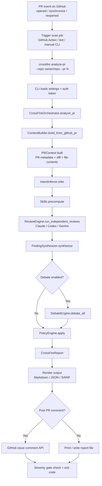

# CrossFire Architecture

## Pipeline Overview

```
PR Input (GitHub API or local diff/patch)
        │
        ▼
┌──────────────────────────┐
│     Context Builder       │  Deep: diff + full files + related files + git history + docs
│     + Intent Inferrer     │  What does this repo DO? What's intended?
└──────────┬───────────────┘
           │
           ▼
┌──────────────────────────┐
│  Independent Agent Reviews│  3 agents each do a FULL independent security review
│  ┌───────┐┌───────┐┌───────┐
│  │Claude ││ Codex ││Gemini │  Each reads code, traces flows, identifies issues
│  └───────┘└───────┘└───────┘
└──────────┬───────────────┘
           │
           ▼
┌──────────────────────────┐
│   Finding Synthesizer     │  Merge independent reviews, cross-validate, dedupe
└──────────┬───────────────┘
           │
           ▼
┌──────────────────────────────────┐
│   Adversarial Debate (per finding)│
│   Prosecutor ←→ Defense ←→ Judge  │  Argue with EVIDENCE from code
│   Majority Consensus              │
└──────────┬───────────────────────┘
           │
           ▼
┌──────────────────────────┐
│    Output / Reports       │  Markdown PR comment, JSON, SARIF, CI gating
└───────────────────────────┘
```

## PR Trigger Flow (GitHub Scan Path)

This is the runtime flow when CrossFire is triggered to scan a pull request (for example from CI/GitHub Actions, a bot, or a manual command).



### Trigger Notes
- **GitHub PR events** typically fire on `opened`, `synchronize` (new commits pushed), and `reopened`.
- The trigger mechanism itself is external to CrossFire (CI workflow, bot, scheduler, or manual invocation).
- CrossFire starts execution at the CLI command (`analyze-pr`) and then enters the orchestrator pipeline.

## Key Components

### Context Builder (`crossfire/core/context_builder.py`)
- Parses unified diffs into structured DiffHunk objects
- Fetches full file content (head + base versions)
- Resolves imports to find related files (Python, JS/TS)
- Discovers reverse imports (who calls this file)
- Finds test files that cover changed code
- Collects git blame summaries
- Gathers CI, Docker, and infrastructure config files
- Supports three depth levels: shallow, medium, deep

### Intent Inferrer (`crossfire/core/intent_inference.py`)
- No LLM calls — pure heuristic-based inference
- Reads README for project description
- Analyzes package metadata (pyproject.toml, package.json)
- Detects capabilities from file structure patterns
- Maps dependencies to capabilities
- Scans for security controls (auth, rate limiting, validation)
- Infers trust boundaries
- Classifies PR intent (feature, bugfix, security fix, etc.)

### Skills (`crossfire/skills/`)
Pre-computed analysis that agents receive as context:
- **Code Navigation**: Import tracing, caller/callee discovery
- **Data Flow Tracing**: Input source → dangerous sink mapping
- **Git Archeology**: Blame, history, code age, security commits
- **Config Analysis**: CI workflow and Docker risk detection
- **Dependency Analysis**: Manifest diffing, risky package flagging
- **Test Coverage**: Coverage gap identification

### Agent Adapters (`crossfire/agents/`)
Each agent supports CLI and API modes:
- **Claude**: Claude Code CLI + Anthropic API
- **Codex**: Codex CLI + OpenAI API
- **Gemini**: Gemini CLI + Google AI API

### Finding Synthesizer (`crossfire/core/finding_synthesizer.py`)
- Clusters similar findings via category + file + line overlap
- Merges evidence from multiple agents
- Boosts confidence for cross-validated findings (2 agents: 1.2x, 3: 1.4x)
- Applies purpose-aware severity adjustments
- Tags findings for debate routing

### Debate Engine (`crossfire/agents/debate_engine.py`)
- Assigns prosecutor/defense/judge roles (rotating or fixed)
- Prosecution argues with code evidence
- Defense counter-argues with controls/context
- Optional rebuttal round
- Judge evaluates evidence quality and rules
- Consensus logic with evidence quality thresholds

## Configuration

Three-layer priority: CLI flags > environment variables > `.crossfire/config.yaml` > defaults.

See `.crossfire/config.example.yaml` for all options.
